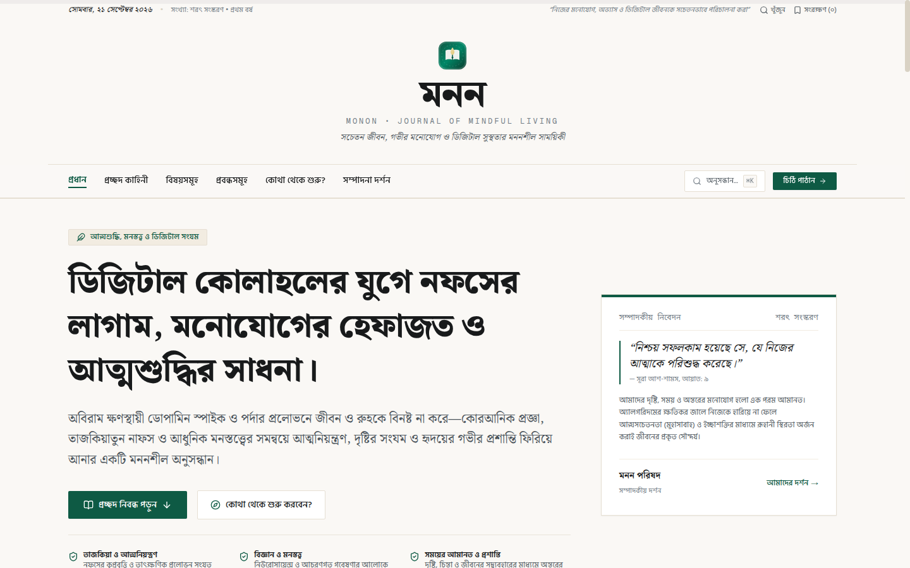
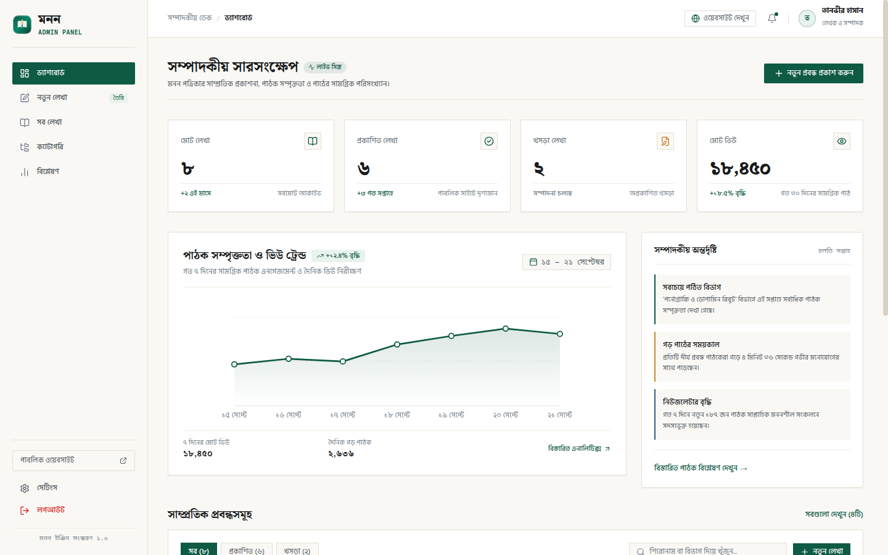

# MONON (মনন) — Journal of Mindful Living & Digital Wellness

> **A thoughtful Bengali digital journal and publication platform dedicated to mindful living, deep focus, and digital wellness.**

[](https://monnon.vercel.app/)
[](https://nextjs.org/)
[](https://react.dev/)
[](https://tailwindcss.com/)
[](https://www.typescriptlang.org/)

**MONON (মনন)** is a full-stack Bengali digital publication platform designed for the hyper-connected, algorithm-driven modern world. It offers evidence-based insights, research essays, and philosophical reflections to help readers reclaim self-control, cultivate deep focus, break digital addictions, and build enduring positive habits.

🌐 **Live Website:** [https://monnon.vercel.app/](https://monnon.vercel.app/)  
🔐 **Admin Portal:** [https://monnon.vercel.app/admin/login](https://monnon.vercel.app/admin/login)

---

## 📸 Visual Previews

### 1. Magazine Landing Page


### 2. Editorial Admin Dashboard


---

## 🎯 Core Vision & Philosophy

In today's notification-saturated world, short-form dopamine traps and endless algorithmic scrolling severely fracture human attention spans and emotional balance. **MONON** bridges scientific neuroscience, behavioral psychology, and timeless stoic philosophy into engaging Bengali long-form essays.

### Key Pillars & Topics:
* **Digital Wellness & Tech Boundaries:** Escaping screen addiction, dopamine fasting, and establishing intentional technology boundaries.
* **Deep Work & Focus Mastery:** Strategies and frameworks for hours of distraction-free, high-leverage intellectual work.
* **Dopamine Reboot & Recovery:** Brain neuroplasticity, breaking compulsive digital behavioral loops, and restoring healthy baseline dopamine.
* **Habit Mastery & Atomic Systems:** The science of micro-habits, cognitive restructuring, and lifelong discipline.
* **Stoic Calm & Emotional Resilience:** Maintaining inner tranquility and clarity amidst external chaos.
* **Authentic Human Connection:** Cultivating meaningful relationships and empathy beyond the artificiality of social media feeds.

---

## ✨ Key Features

### 📖 1. Immersive Article Reader (`/articles/[slug]`)
* **Dedicated Reading Interface:** Clean distraction-free typography with custom drop-caps and highlighted pull quotes.
* **3 Reading Themes:** Switch between **Default Light**, **Warm Sepia Paper**, and **Night Dark Mode** for optimal eye comfort.
* **Dynamic Font Scaling:** Instant text resizing controls (Normal, Medium, Large) for enhanced accessibility.
* **Interactive Engagement:** Live reader likes counter and structured comment discussions with instant feedback.
* **Social Sharing & Bookmarking:** One-click sharing to social channels and quick copy link.

### 📊 2. Comprehensive Admin Control Deck (`/admin`)
* **Live Overview (`/admin/dashboard`):** Real-time tracking of published essays, reader traffic, subscriber growth, and category metrics.
* **Article Management (`/admin/articles`):** Full CRUD editor with slug generation, topic categorization, rich preview, and draft/publish toggles.
* **Taxonomy & Category Manager (`/admin/categories`):** Create and organize thematic publication pillars with featured quotes and badge styles.
* **Reader Analytics (`/admin/analytics`):** Graphical breakdowns of audience engagement, reading completion rates, and trending topics.
* **Editorial Profile Settings (`/admin/settings`):** Update administrator profile details, bio, and security credentials.

### 🎨 3. Editorial Print-Inspired Aesthetics & Bengali Typography
* **Curated Bengali Typography:** Classical `Noto Serif Bengali` for editorial headlines paired with ultra-clean `Hind Siliguri` for readable UI and prose.
* **Modern Design Tokens:** Emerald Teal (`#0E5A44`), Warm Paper Sand (`#FAF8F5`), and Crisp Border Lines (`#E6DFD3`).
* **Accessible Component Architecture:** Crafted with Tailwind CSS v4 and accessible shadcn/ui primitives.

---

## 🏛️ Full-Stack Monorepo Architecture

```
articles/ (Monorepo Root)
├── articel-pr/             # Frontend Client (Next.js 16 App Router, React 19, Tailwind CSS v4, shadcn/ui)
└── article-pr-server/      # Backend REST API (Node.js 22, Express, TypeScript, PostgreSQL Connection Pool)
```

---

## 🛠️ Technology Stack

### Frontend (`articel-pr`)
* **Framework:** [Next.js 16.3.5](https://nextjs.org/) (App Router, Turbopack)
* **Core Library:** [React 19](https://react.dev/)
* **Language:** [TypeScript 5](https://www.typescriptlang.org/)
* **Styling:** [Tailwind CSS v4](https://tailwindcss.com/) & [shadcn/ui](https://ui.shadcn.com/)
* **Icons:** [Lucide React](https://lucide.dev/)
* **Typography:** Google Fonts (`Noto Serif Bengali`, `Hind Siliguri`, `Geist Mono`)
* **Deployment:** [Vercel](https://vercel.com/)

### Backend REST API (`article-pr-server`)
* **Server Framework:** [Express.js](https://expressjs.com/) on Node.js 22 (MVC Pattern)
* **Database:** [PostgreSQL](https://www.postgresql.org/)
* **Authentication:** JWT (JSON Web Tokens) with Bcrypt password hashing
* **Security Middleware:** Helmet, CORS, Express Rate Limit
* **Validation:** Zod schemas

---

## 🚀 Getting Started (Local Development)

### 1. Prerequisites
- **Node.js**: `v20+` or `v22+`
- **npm** or **pnpm**
- **PostgreSQL** instance (or cloud Neon / Supabase database)

### 2. Clone Repository
```bash
git clone https://github.com/tanvirislam06408/articel-pr.git
cd articel-pr
```

### 3. Install Dependencies & Run Development Server
```bash
# Install frontend dependencies
npm install

# Start Next.js development server
npm run dev
```

- **Frontend App:** [http://localhost:3000](http://localhost:3000)
- **Admin Login:** [http://localhost:3000/admin/login](http://localhost:3000/admin/login)
- **Production API:** [https://article-pr-server.vercel.app/api/v1](https://article-pr-server.vercel.app/api/v1)

---

## 🔐 Super Admin Credentials

Use these credentials to access the editorial management dashboard:

| Field | Value |
| :--- | :--- |
| **Login URL** | `https://monnon.vercel.app/admin/login` or `http://localhost:3000/admin/login` |
| **Email** | `mstanvirislam05@gmail.com` |
| **Password** | `tanvir-admin` |

*(Note: A one-click demo credential filler is available on the login page for quick access.)*

---

## 📂 Project Structure

```
articel-pr/
├── app/
│   ├── layout.tsx              # Root HTML, Bengali Google fonts & AuthProvider
│   ├── page.tsx                # Magazine Homepage (Hero, Cover Story, Topic Sections)
│   ├── articles/[slug]/        # Dynamic Reader Page with Themes & Comments
│   └── admin/                  # Editorial Admin Deck
│       ├── page.tsx            # Admin Root Redirect Guard
│       ├── login/              # Admin Authentication
│       ├── dashboard/          # Performance & Editorial Summary
│       ├── articles/           # Article Manager, Editor & Search
│       │   └── new/            # New Article Creation Workspace
│       ├── categories/         # Categories & Taxonomies
│       ├── analytics/          # Reader Engagement & Traffic Metrics
│       └── settings/           # Profile & System Configuration
├── components/
│   ├── home/                   # Homepage UI Modules (HeroSection, CoverStory, TopicsSection)
│   ├── layout/                 # Main Header, Navbar & Footer
│   ├── article/                # Reading Theme Controls, Reader View & Share Modal
│   ├── admin/                  # AdminSidebar, AdminHeader, MetricCards, Charts & Tables
│   └── ui/                     # Reusable Buttons, Dialogs, Inputs, Toasts & Spinners
├── lib/
│   ├── api.ts                  # Centralized Backend REST API Client
│   ├── auth-context.tsx        # React Authentication Context & Session State
│   ├── data/                   # Fallback Offline Datasets (Articles, Topics, Metrics)
│   └── utils.ts                # Date formatting, Bengali number converters, and class utilities
└── public/
    ├── favicon.svg             # Monon Branding Favicon
    ├── preview-landing.png     # Landing Page Screenshot
    └── preview-dashboard.png   # Admin Dashboard Screenshot
```

---

## 🤝 Contributing

Contributions, feature suggestions, and editorial ideas are warmly welcomed!

1. **Fork** the repository.
2. Create your feature branch: `git checkout -b feature/your-feature-name`
3. Commit your changes: `git commit -m 'feat: add exciting new reading feature'`
4. Push to the branch: `git push origin feature/your-feature-name`
5. Open a **Pull Request**.

---

## 📜 Editorial Charter & Disclaimer

* All essays published on **MONON** are crafted for personal development, mindful reflection, and research purposes. They do not constitute formal medical or psychiatric treatment.
* **MONON** is committed to high-standard, reflective intellectual discourse—free from clickbait, sensationalism, and algorithmic distractions.

---

## 📄 License

This project is licensed under the [MIT License](LICENSE).

---

*“Cultivating peaceful minds, deep readings, and purposeful living.” — MONON Editorial Board.*
